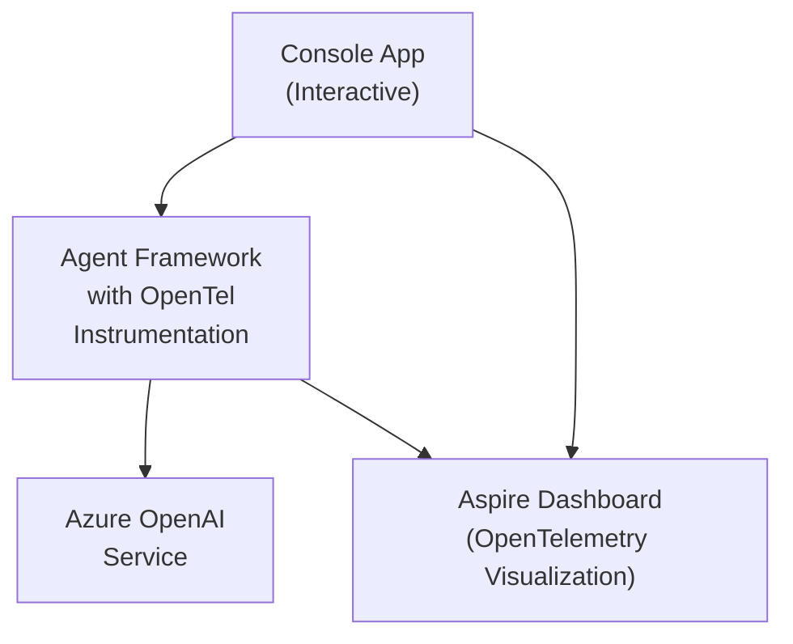

# OpenTelemetry Aspire Demo with Azure OpenAI

This demo showcases the integration of OpenTelemetry with the Microsoft Agent Framework using Azure OpenAI and .NET Aspire Dashboard for telemetry visualization.

## Overview

The demo consists of three main components:

1. **Aspire Dashboard** - Provides a web-based interface to visualize OpenTelemetry data
2. **Console Application** - An interactive console application that demonstrates agent interactions with proper OpenTelemetry instrumentation
3. **[Optional] Application Insights** - When the agent is deployed to a production environment, Application Insights can be used to monitor the agent performance.

## Architecture



## Prerequisites

- .NET 8.0 SDK or later
- Azure OpenAI service endpoint and deployment configured
- Azure CLI installed and authenticated (for Azure credential authentication)
- Docker installed (for running Aspire Dashboard)
- [Optional] Application Insights and Grafana

## Configuration

### Azure OpenAI Setup
Set the following environment variables:
```powershell
$env:AZURE_OPENAI_ENDPOINT="https://your-resource.openai.azure.com/"
$env:AZURE_OPENAI_DEPLOYMENT_NAME="gpt-4o-mini"  # Optional, defaults to gpt-4o-mini
```

**Note**: This demo uses Azure CLI credentials for authentication. Make sure you're logged in with `az login` and have access to the Azure OpenAI resource.

### [Optional] Application Insights Setup
Set the following environment variables:
```powershell
$env:APPLICATIONINSIGHTS_CONNECTION_STRING="InstrumentationKey=XXXX;IngestionEndpoint=https://XXXX.applicationinsights.azure.com/;LiveEndpoint=https://XXXXX.livediagnostics.monitor.azure.com/;ApplicationId=XXXXX"
```

## Running the Demo

### Quick Start (Using Script)

The easiest way to run the demo is using the provided PowerShell script:

```powershell
.\start-demo.ps1
```

This script will automatically:
- ✅ Check prerequisites (Docker, Azure OpenAI configuration)
- 🔨 Build the console application
- 🐳 Start the Aspire Dashboard via Docker (with anonymous access)
- ⏳ Wait for dashboard to be ready (polls port until listening)
- 🌐 Open your browser with the dashboard
- 📊 Configure telemetry endpoints (http://localhost:4317)
- 🎯 Start the interactive console application

### Manual Setup (Step by Step)

If you prefer to run the components manually:

#### Step 1: Start the Aspire Dashboard via Docker

```powershell
docker run -d --name aspire-dashboard -p 4318:18888 -p 4317:18889 -e DOTNET_DASHBOARD_UNSECURED_ALLOW_ANONYMOUS=true mcr.microsoft.com/dotnet/aspire-dashboard:9.0
```

#### Step 2: Access the Dashboard

Open your browser to: http://localhost:4318

#### Step 3: Run the Console Application

```powershell
cd dotnet/demos/AgentOpenTelemetry
$env:OTEL_EXPORTER_OTLP_ENDPOINT="http://localhost:4317"
dotnet run
```

#### Interacting with the Console Application

You should see a welcome message like:

```
=== OpenTelemetry Aspire Demo ===
This demo shows OpenTelemetry integration with the Agent Framework.
You can view the telemetry data in the Aspire Dashboard.
Type your message and press Enter. Type 'exit' or empty message to quit.

You:
```

1. Type your message and press Enter to interact with the AI agent
2. The agent will respond, and you can continue the conversation
3. Type `exit` to stop the application

**Note**: Make sure the Aspire Dashboard is running before starting the console application, as the telemetry data will be sent to the dashboard.

#### Step 4: Test the Integration

1. **Start the Aspire Dashboard** (if not already running)
2. **Run the Console Application** in a separate terminal
3. **Send a test message** like "Hello, how are you?"
4. **Check the Aspire Dashboard** - you should see:
   - New traces appearing in the **Traces** tab
   - Each trace showing the complete agent interaction flow
   - Metrics in the **Metrics** tab showing token usage and duration
   - Logs in the **Structured Logs** tab with detailed information

## Viewing Telemetry Data in Aspire Dashboard

### Traces
1. In the Aspire Dashboard, navigate to the **Traces** tab
2. You'll see traces for each agent interaction
3. Each trace contains:
   - An outer span for the entire agent interaction
   - Inner spans from the Agent Framework's OpenTelemetry instrumentation
   - Spans from HTTP calls to Azure OpenAI

### Metrics
1. Navigate to the **Metrics** tab
2. View metrics related to:
   - Agent execution duration
   - Token usage (input/output tokens)
   - Request counts

### Logs
1. Navigate to the **Structured Logs** tab
2. Filter by the console application to see detailed logs
3. Logs include information about user inputs, agent responses, and any errors

## [Optional] View Application Insights data in Grafana
Besides the Aspire Dashboard and the Application Insights native UI, you can also use Grafana to visualize the telemetry data in Application Insights. There are two tailored dashboards for you to get started quickly:

### Agent Overview dashboard
Open dashboard in Azure portal: <https://aka.ms/amg/dash/af-agent>


### Workflow Overview dashboard
Open dashboard in Azure portal: <https://aka.ms/amg/dash/af-workflow>


## Key Features Demonstrated

### OpenTelemetry Integration
- **Automatic instrumentation** of Agent Framework operations
- **Custom spans** for user interactions
- **Proper span lifecycle management** (create → execute → close)
- **Telemetry correlation** across the entire request flow

### Agent Framework Features
- **ChatClientAgent** with Azure OpenAI integration
- **OpenTelemetry wrapper** using `.WithOpenTelemetry()`
- **Conversation threading** for multi-turn conversations
- **Error handling** with telemetry correlation

### Aspire Dashboard Features
- **Real-time telemetry visualization**
- **Distributed tracing** across services
- **Metrics and logging** integration
- **Resource management** and monitoring

## Available Script

The demo includes a PowerShell script to make running the demo easy:

### `start-demo.ps1`
Complete demo startup script that handles everything automatically.

**Usage:**
```powershell
.\start-demo.ps1           # Start the complete demo
```

**Features:**
- **Automatic configuration detection** - Checks for Azure OpenAI configuration
- **Project building** - Automatically builds projects before running
- **Error handling** - Provides clear error messages if something goes wrong
- **Multi-window support** - Opens dashboard in separate window for better experience
- **Browser auto-launch** - Automatically opens the Aspire Dashboard in your browser
- **Docker integration** - Uses Docker to run the Aspire Dashboard

**Docker Endpoints:**
- **Aspire Dashboard**: `http://localhost:4318`
- **OTLP Telemetry**: `http://localhost:4317`

## Troubleshooting

### Port Conflicts
If you encounter port binding errors, try:
1. Stop any existing Docker containers using the same ports (`docker stop aspire-dashboard`)
2. Or kill any processes using the conflicting ports

### Authentication Issues
- Ensure your Azure OpenAI endpoint is correctly configured
- Check that the environment variables are set in the correct terminal session
- Verify you're logged in with Azure CLI (`az login`) and have access to the Azure OpenAI resource
- Ensure the Azure OpenAI deployment name matches your actual deployment

### Build Issues
- Ensure you're using .NET 9.0 SDK
- Run `dotnet restore` if you encounter package restore issues
- Check that all project references are correctly resolved

## Project Structure

```
AgentOpenTelemetry/
├── AgentOpenTelemetry.csproj             # Project file with dependencies
├── Program.cs                            # Main application with Azure OpenAI agent integration
├── start-demo.ps1                        # PowerShell script to start the demo
└── README.md                             # This file
```

## Next Steps

- Experiment with different prompts to see various telemetry patterns
- Explore the Aspire Dashboard's filtering and search capabilities
- Try modifying the OpenTelemetry configuration to add custom metrics or spans
- Integrate additional services to see distributed tracing in action
